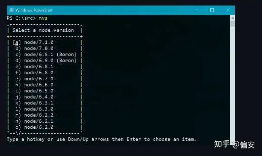
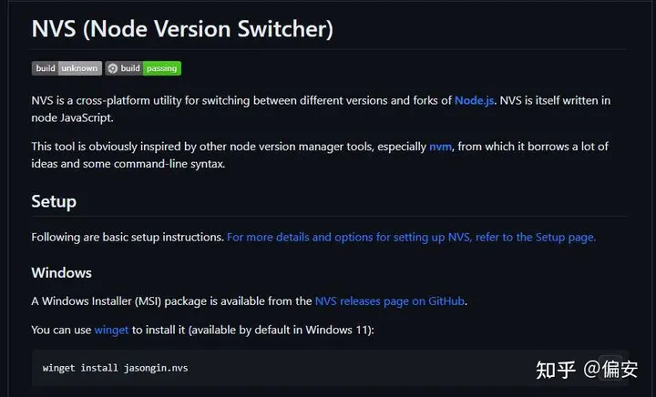
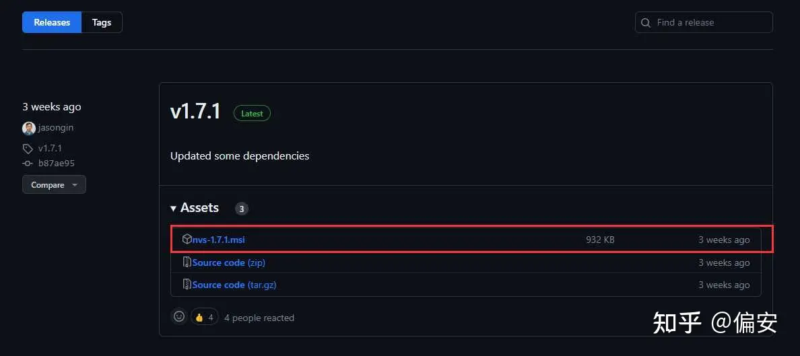

## **0. 仓库地址**

NVS：[https://github.com/jasongin/nvs](https://link.zhihu.com/?target=https%3A//github.com/jasongin/nvs)

## **1. 背景描述**

我们在基于Node.js进行开发时，通常情况下只需要从**[Node.js官网](https://link.zhihu.com/?target=https%3A//nodejs.org/)**下载对应的安装包，完成环境配置后即可投入开发。但有些情况下，我们负责多个项目的开发和维护，但是它们使用多个不同版本的Node，这种情况下总不能切换一个项目就重新安装一次Node，为此，我们需要快速更新或切换Node版本。

现在开源社区有多种Node版本管理的工具，比如 **[nvm](https://link.zhihu.com/?target=https%3A//github.com/creationix/nvm)**、**[n](https://link.zhihu.com/?target=https%3A//github.com/tj/n)** 等，在这里我们推荐使用**[nvs](https://link.zhihu.com/?target=https%3A//github.com/jasongin/nvs)**工具。笔者是win11操作系统，在使用nvm过程中遇到过一些无法理解的问题，但nvs使用过程中一切正常，目前还未遇到难以解决的问题。

## **2. nvs简介**

NVS(Node Version Switcher)是一个跨平台的工具，用于在Node.js的不同版本和分支之间切换。NVS本身是用Node.js编写的。

这个工具显然受到了其他节点版本管理器工具的启发，尤其是nvm，它借鉴了nvm的许多思想和一些命令行语法。



## **3. nvs安装**

### **3.1 Windows**

我们可以使用winget命令进行安装（Win11系统默认支持winget）：

```bash
winget install jasongin.nvs
```

也可以使用chocolatey进行安装：

```bash
choco install nvs
```

还可以直接下载其发布版本的msi文件进行安装：

**[Releases](https://link.zhihu.com/?target=https%3A//github.com/jasongin/nvs/releases)**



### **3.2 Mac和Linux**

指定安装路径，克隆仓库，执行install命令:

```bash
export NVS_HOME="$HOME/.nvs"
git clone https://github.com/jasongin/nvs "$NVS_HOME"
. "$NVS_HOME/nvs.sh" install
```

## **4. nvs基本使用**

安装最新版本Node：

```bash
nvs add latest
```

或者安装最新的LTS版本Node：

```bash
nvs add lts
```

然后运行`nvs use`命令将指定版本的Node添加到环境变量中：

```bash
nvs use lts
或
nvs use 14.21.0
```

如果想永久添加到环境变量中，则需要使用`nvs link`命令，此命令也相当于给操作系统全局设置一个Node的默认版本：

```bash
nvs link lts
```

## **5. nvs命令手册**

|Command|Description|
|---|---|
|nvs help <command>|获取帮助|
|nvs install|初始化nvs配置|
|nvs uninstall|从环境变量删除nvs|
|nvs --version|显示nvs的版本|
|nvs add [version]|下载安装某个版本的Node.js|
|nvs rm <version>|删除某个版本的Node.js|
|nvs migrate <fromver> [tover]|迁移全局模块|
|nvs upgrade [fromver]|升级到主版本的最新补丁|
|nvs use [version]|在当前shell中使用某个版本的Node.js|
|nvs auto [on/off]|根据cwd（当前工作路径）自动切换Node.js版本|
|nvs run <ver> <js> [args...]|使用某个版本的Node.js运行js脚本|
|nvs exec <ver> <exe> [args...]|使用某个版本的Node.js运行可执行文件|
|nvs which [version]|显示某个版本的Node.js二进制文件的路径|
|nvs ls [filter]|显示本地已安装的Node.js列表|
|nvs ls-remote [filter]|显示远端可安装的Node.js列表|
|nvs link [version]|链接一个默认版本|
|nvs unlink [version]|删除指向默认版本的链接|
|nvs alias [name] [value]|设置或收回版本的别名|
|nvs remote [name] [value]|设置或收回下载基础uri|

一个具体版本或者版本过滤词由一个完整的或者部分的语义版本号或者版本标签（"lts", "latest", "Argon"等）组成，也可以是远端的版本名称，或者使用斜杠分隔来指定架构版本。例如："lts", "4.6.0", "6/x86", "node/6.7/x64"等。

## **6. VS Code支持**

Visual Studio Code可以使用NVS在启动或调试时选择要使用的节点版本。在`${项目目录}/.vscode/launch.json`文件中添加一个带有NVS版本字符串的"runtimeArgs"属性和一个"runtimeExecutable"属性用于指向nvs.cmd (Windows)或nvs (Mac、Linux)。如果NVS不在VS Code需要的Path环境变量中，我们可能需要指定一个绝对路径，例如`${env:HOME}/.nvs/nvs`。

以下是一个使用6.10版本Node.js的launch.json文件示例：

```json
  "configurations": [
    {
      "type": "node",
      "request": "launch",
      "name": "Launch Program",
      "program": "${file}",
      "args": [ ],
      "runtimeArgs": [ "6.10" ],
      "windows": { "runtimeExecutable": "nvs.cmd" },
      "osx": { "runtimeExecutable": "nvs" },
      "linux": { "runtimeExecutable": "nvs" }
    },
  ]
```

## **7.总结**

本文介绍了一种Node.js多版本管理和快速切换的解决方案和工具NVS，包括了如何安装、如何使用以及如何支持VS Code等，除了此工具外，还有nvm、n工具也实现了与nvs相同的功能，开发者可以根据自身需求选择适合自己的工具。