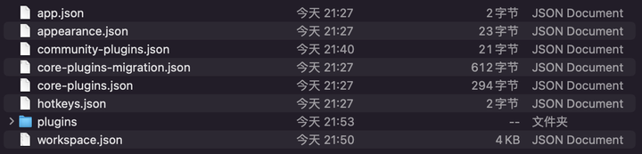
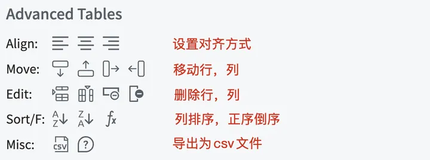
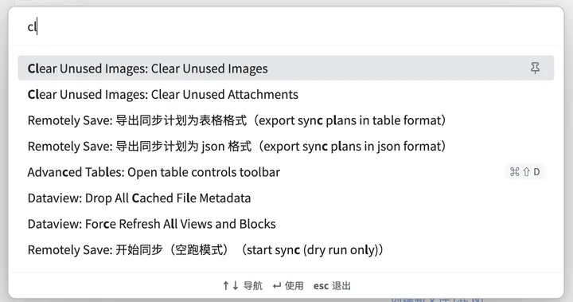
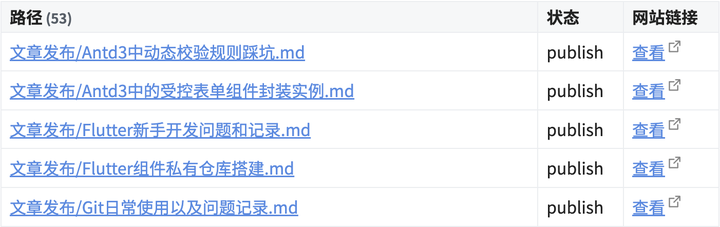
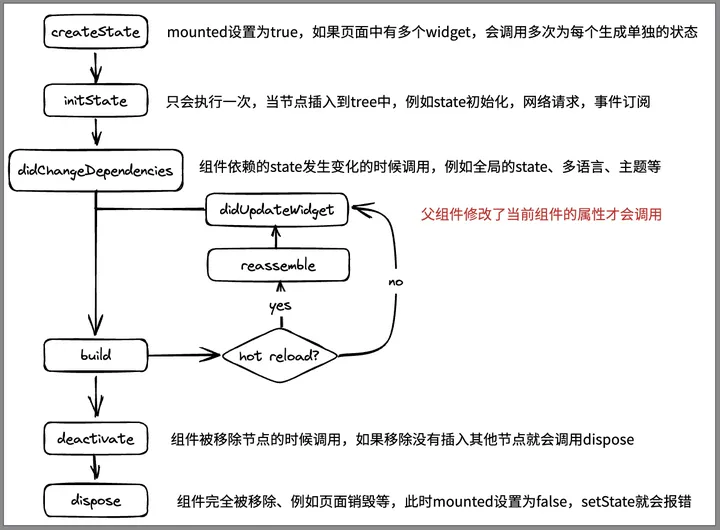
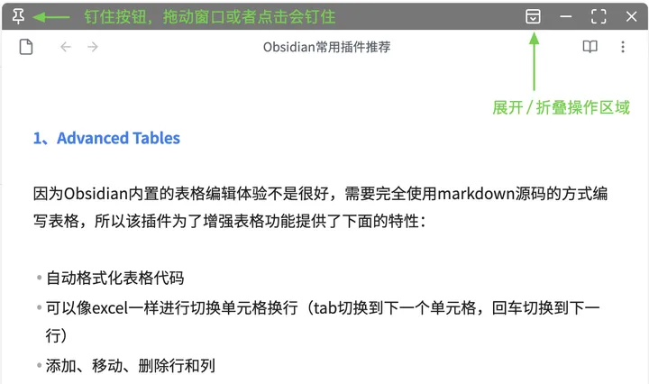
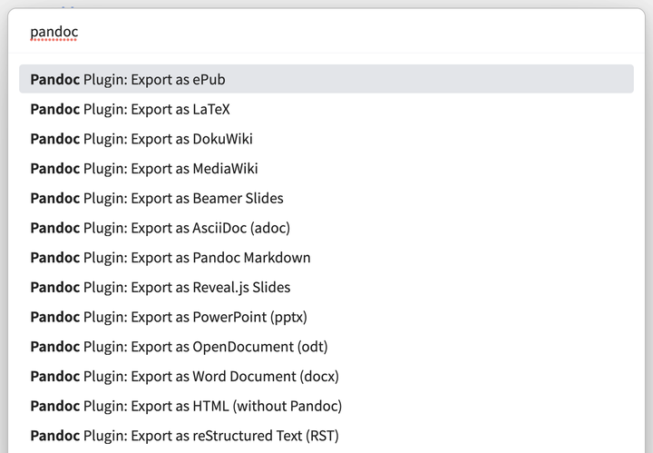
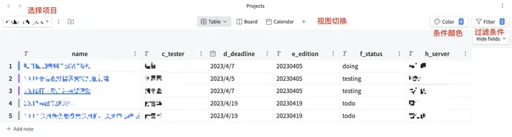
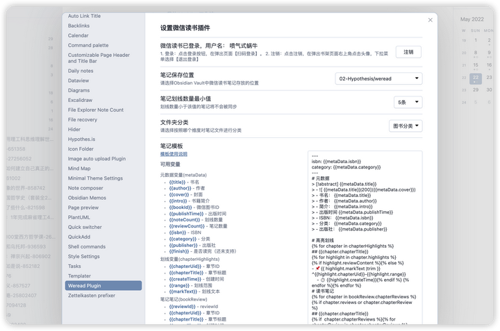
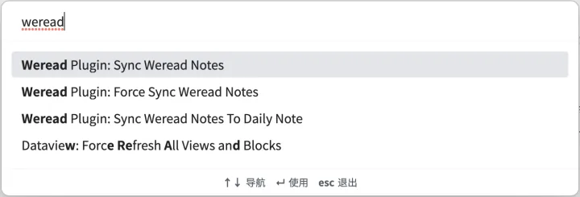

Obsidian作为一款优秀且免费的笔记软件，加上其灵活的插件系统设计，市场上有很多的插件让它变成了一个很强大的笔记系统，如果插件使用的好，完全可以提升自己的写作能力和整理能力，本文将推荐一些个人在使用的一些插件供大家使用。因为国内网络的原因，我已经将下面提到的插件全部打包上传到了阿里云盘上，大家可以下载后使用。

下载地址：[阿里云盘分享链接](https://link.zhihu.com/?target=https%3A//www.aliyundrive.com/s/siRvyKo7pbD)。如果插件有版本更新，我会重新上传新版本的插件，大家可以查看上传时间来重新更新自己本机的插件。

下载插件后放到插件目录在Obsidian中开启即可使用，插件存储的目录在哪里呢？我们打开笔记本目录，可以看到一个 `.obsidian` 文件夹（**如果没有找到这个文件夹，需要在文件管理器中设置展示隐藏文件后才可以看到**），打开后内容如下所示：



plugins目录就是插件的目录，打开就能看到已经下载的插件，如果没有plugins文件夹就手动创建一个。

因为插件的名称和下载之后目录的名称不一定相同，所以我做了一个对照表，大家可以参考

| 插件名（文章中写的）                        | 插件文件夹（分享在阿里云盘的目录）                 |
| --------------------------------- | --------------------------------- |
| Advanced Tables                   | table-editor-obsidian             |
| Auto Link Title                   | obsidian-auto-link-title          |
| Clear Unused Images               | oz-clear-unused-images            |
| Commander                         | cmdr                              |
| Dataview                          | dataview                          |
| Excalidraw                        | obsidian-excalidraw-plugin        |
| Hover Editor                      | obsidian-hover-editor             |
| Image auto upload Plugin          | obsidian-image-auto-upload-plugin |
| Outliner                          | obsidian-outliner                 |
| Pandoc Plugin                     | obsidian-pandoc                   |
| Projects                          | obsidian-projects                 |
| Publish to WordPress for Obsidian | obsidian-wordpress                |
| Local images                      | obsidian-local-images             |
| Remotely Save                     | remotely-save                     |
| Weread Plugin                     | obsidian-weread-plugin            |

**注意：**

1. 首次下载插件后，放到插件目录需要在Obsidian中启用才可使用
1. 大家如果是更新插件，请不要直接删除原来的文件夹，只需要覆盖除了data.json之外的文件即可（**data.json文件保存了插件的配置，删除后会导致插件配置丢失**）

下面进入正题，推荐我常用的插件。

## 1、Advanced Tables

因为Obsidian内置的表格编辑体验不是很好，需要完全使用markdown源码的方式编写表格，该插件为了增强表格功能提供了下面的特性：

- 自动格式化表格代码（使用tab或者回车的时会自动对齐表格列分隔符）
- 可以像excel一样进行切换单元格换行（tab切换到下一个单元格，回车切换到下一行）
- 添加、移动、删除行和列
- 设置列的对齐方式（左对齐、右对齐、居中对齐）
- 对列数据进行排序
- 支持移动端编辑器

安装完成，可以右侧面板就可以看到表格操作的工具了，将光标放在表格中就可以操作了。



## 2、Auto Link Title

粘贴链接后显示为网页的标题，例如粘贴了 [https://www.baidu.com/](https://link.zhihu.com/?target=https%3A//www.baidu.com/) 就会展示成下面的内容，自动拉取网页的标题，对于引用文章等比较方便，网页标题比网址更加的直观。

```text
[百度一下，你就知道](https://www.baidu.com/)
```

## 3、Clear Unused Images

在写笔记时，经常会粘贴一些图片到笔记中，图片也会存储到Obsidian的附件文件夹，如果后期在笔记中删除了图片的引用，附件里面的图片并不会被删除，所以我们可以使用该插件清理没有引用到的图片，释放磁盘空间也避免杂乱无章。该插件支持的功能如下：

- 删除的图片可以选择放到回收站或者永久删除
- 排除某些文件夹不清理（对于我们专门存储图片的文件夹可以排除之外）

使用方式：使用 CMD/Ctrl + P 打开命令，搜索Clear 就可以看到，执行后即可清除未引用的图片



## 4、Commander

可以在编辑器的多处位置添加操作按钮来执行操作，例如保存文件、上传图片、lint文件、发布文章等。主要支持下面的位置添加操作按钮：

- 编辑器右键菜单
- 编辑器右上角功能按钮
- 编辑器最左侧侧边栏（打开日历、快速切换那一块）
- 编辑器状态栏
- 组合命令（可以将一系列操作合并成一个命令，使用 CMD/Ctrl + P 打开调用，也可以使用Commander添加到上述的任意位置 ）

## 5、Dataview

使用代码块实现的数据视图插件，可以通过一定的语法去汇总、查询笔记中的数据，如果利用的好能很大的提升自己的效率和使用笔记的体验。

因为特性比较多，可以去 [官方文档](https://link.zhihu.com/?target=https%3A//blacksmithgu.github.io/obsidian-dataview/) 查看具体使用方式，下面简单的列一下基本用法，如果会一些编程的知识，使用起来犹如鱼得水：

- 根据元数据（元数据可以是文件名称、创建时间、修改时间、metadata等）查询为表格视图，列表视图
- 查询待办任务（支持过滤完成未完成、支持按照文件名称分组）
- 支持js API可以进行更加高级的查询
- 内置常用的函数处理数据

下面是我查询发布文章的代码

```text
table WITHOUT ID
link(file.path, file.path) as "路径", default(status, "publish") as "状态",  elink("https://gslnzfq.cn/archives/"+post_id, "查看") as "网站链接"
where post_id>0
sort default(status, "publish") desc
```

实现效果如下所示，我们可以直接点击右侧链接查看发布的文章详情



## 6、Excalidraw

手绘风格的绘图插件，更新比较勤快，可以画出很好看的手绘风格图片，支持导出png、svg等，并且支持在笔记内部实时预览。

绘制的图片效果大概如下：



该插件支持的功能：

- 常见形状的绘制，排版
- 内置英文手绘字体，如果需要中文也支持手绘体，推荐下载 [Muyao-Softbrush](https://link.zhihu.com/?target=https%3A//www.freechinesefont.com/simplified-muyao-softbrush-download/)
- 下载扩展的UI库实现复杂的图形
- 下载脚本实现对绘图功能的扩展
- 导出png/svg等

## 7、Hover Editor

增强双链hover之后的浮窗的功能，Obsidian内置的是一个只读的浮窗，并且只能同时展示一个。该插件可以将弹窗的浮窗变成一个完整编辑器，并且可以钉住浮窗，就可以同时打开多个浮窗了。

下面是是该插件实现的浮窗的预览图片



该插件支持的功能如下：

- 浮窗可编辑，可以设置默认的模式或者跟随当前编辑器状态
- 支持最大化、最小化、钉住
- 支持同时打开多个（在笔记汇总的时候很有用）

## 8、Image auto upload Plugin

上传图片插件，可以设置粘贴图片时直接上传到图床，也可以在某一篇笔记中使用命令执行上传文章内的图片。这个功能在我们将笔记发布到三方平台或者迁移的时候很有用，迁移的时候我们只需要将笔记文件单个markdown文件拷走就行，不用关注有哪些图片。

该插件使用的是Picgo去上传图片的，所以我们还需要在系统中安装Picgo并配置好图床，点击打开[Picgo下载地址](https://link.zhihu.com/?target=https%3A//molunerfinn.com/PicGo/)，下载完成请查看[配置文档](https://link.zhihu.com/?target=https%3A//picgo.github.io/PicGo-Doc/zh/guide/)，Picgo是一个免费开源的图床软件支持将图片上传到多个平台。

**注意：**如果笔记开启了Wiki链接，可能会导致该插件找不到图片，无法上传。需要在设置中关闭Wiki链接后，重新粘贴图片或者将wiki链接修改为普通链接再进行上传。

普通链接即markdown格式链接，下面是wiki链接和普通链接的区别：

```text
下面是wiki链接
![[20230409153023.png]]

下面是普通链接

```

使用方式：使用 CMD/Ctrl + P 打开命令，查找 upload 执行即可。

## 9、Outliner

一个有序列表、无序列表、待办列表增强的插件。使用快捷键快速进行操作，更多请查看文档：

- 对列表项上下移动
- 对于子列表缩进、取消缩进
- 展开折叠子列表
- 列表内回车事件增强

## 10、Pandoc Plugin

集成Obsidian集成Pandoc插件，Pandoc是一个强大的文档工具，在Obsidian中主要做导出操作，可以导出为各种格式的文件，常见的有word、epub等，完整的导出格式如下所示：



如果我们使用Obsidian进行写作，那我们可以将内容导出为epub供大家阅读。

使用方式：使用 CMD/Ctrl + P 打开命令，查找 pandoc 执行即可。

**注意：**该插件调用的是操作系统安装的pandoc，所以我们首先要在系统上安装pandoc，详细安装说明请查看 [官方文档](https://link.zhihu.com/?target=https%3A//pandoc.org/installing.html)。

## 11、Projects

该插件名称是Projects，也比较容易理解，可以读取某个文件夹下面的笔记并通过读取metadata生成表格，在项目管理的时候用的比较多。也可以理解为dataview的图形版本，他会提供三种视图：table、kanban、calendar，下面是我使用的一个样例：



上述生成的项目列的字段也是通过metadata存储的，所以我们也可以使用dataview进行高级查询，例如我们可以通过d_deadline展示还有多久到期等。

## 12、Publish to WordPress for Obsidian

如果你也使用WordPress，并且想使用Obsidian作为文章编辑器来发布文章，这个插件将是一个很好的选择，目前支持下面的功能：

- 发布文章
- 修改文章（会在发布的时候保存标签、分类、文章状态等信息）
- 支持WordPress官方和自己搭建的wordpress网站

目前还有一些限制，需要注意一下

- 文章中的图片需要放到图床上，因为该插件不会上传图片
- 文章中的双向链接不会被转换，因为有不会同时发布关联文章，也不能去这样做，如果关联的文章并不想发布到公开的平台
- 有些格式无法使用，例如callout样式等，只支持标准的markdown

我的网站的所有文章都是通过obsdian编写并且发布的，欢迎访问：[https://gslnzfq.cn/](https://link.zhihu.com/?target=https%3A//gslnzfq.cn/)

## 13、Local images

可以说和 Image auto upload Plugin 插件相反，该插件可以查找笔记中的外部图片并下载，可能会说这个插件的使用场景是什么呢，下面是我想到的一些场景：

- 自己搭建图床的服务器要过期了，例如我之前使用的阿里的OSS要过期了，那我就下载图片后重新配置其他图床再上传
- 使用剪藏插件剪藏的其他网站的内容，需要将图片下载到本地，防止其资源过期或删除等导致文章图片无效

使用方式：使用 CMD/Ctrl + P 打开命令，查找插件名称执行即可。

## 14、Remotely Save

这是一款同步笔记的插件，该插件可以将笔记内容同步到S3/Dropbox/Webdav/OneDrive上，方便在多个设备之间进行笔记共享。这个插件的出现是因为几个原因：

- 官方提供的同步服务比较贵，包月10美元或者包年96美元
- 如果设备比较多，仅仅使用Onedrive或者一些云服务无法满足需求

S3/Dropbox/OneDrive这些都是云服务就不多说了，webdav是一个网盘提供的功能，例如国内的坚果云等就可以使用webdav。还有Cloudreve、nextcloud这种自建网盘也支持webdav。

有了这个插件，不管任何操作系统都可以同步笔记了。但是在使用的时候还是不建议多个终端修改同一个文件后同步，可能会导致内容丢失，最好是一个终端修改后同步，然后在别的终端修改之前也进行一次同步。

**注意：**为了安全性，建议使用自建云服务的时候使用https，否则会有数据被窃取的风险。

## 15、Weread Plugin

感谢

[@星星不见啦](https://www.zhihu.com/people/7c3a91387afb31915530386d1a0a146a)

推荐，这款插件可以同步微信读书的笔记到obsidian中，该插件的文档说明很详细，这里就不赘述了，这里是插件的[文档说明链接](https://link.zhihu.com/?target=https%3A//gslnzfq.github.io/obsidian-weread-plugin/)（该链接基于作者的仓库部署的），下图是文档截图。



配置完成之后，我们可以使用 CMD/Ctrl + P 打开命令，查找 weread 执行即可，支持下面的三个操作。

该插件的github链接在[这里](https://link.zhihu.com/?target=https%3A//github.com/zhaohongxuan/obsidian-weread-plugin)，有些网络可能无法访问，那就直接在上述分享的文件夹下载插件查看使用文档使用即可。

## 在线下载插件方案

上述的插件都是阿里云盘存储的，有时候可能更新不是很及时，所以我写了一个插件代理服务，可以通过插件实现在Obsidian下载和更新插件，请查看下面的文章：

[老程：我用Next.js写了一个Obsidian代理服务，无需翻墙就可以随意下载插件9 赞同 · 0 评论文章](https://zhuanlan.zhihu.com/p/626212787)

## 后记

大家如果有推荐的插件，也可以在评论区分享给我，或者有使用疑问也可以在评论区提出一起探讨。
